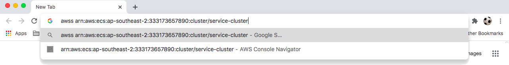
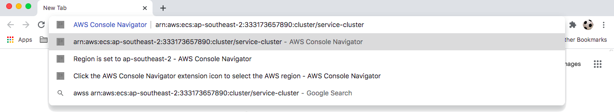

# AWS Console Navigator

AWS Console Navigator Chrome extension. Navigate to resources in the AWS console from the Omnibox.
To use, type keyword 'awss' space an ARN, AWS resource ID or service:resourceID (ARN substring) into the Omnibox.

Sign in to an AWS account is required to access the AWS management console.

## Navigation examples

- awss vpc-5a03f891
- awss i-791d1788
- awss arn:aws:ecs:ap-southeast-2:333173657890:cluster/service-cluster
- awss cluster/service-cluster
- awss stack/service-cluster-stack
- awss arn:aws:dynamodb:us-east-1:206936434116:table/transaction
- awss table/transaction

## Region selection for navigation by resource ID and service:resourceID (ARN substring)

Click the AWS Console Navigator extension icon to select the AWS region for navigation by resource ID and service:resourceID (ARN substring). The selected region is highlighted in the popup and displayed as an Omnibox suggestion. Region selection is not required for navigation by ARN.

## Supported resources

### Navigate by resource ID or ARN or service:resourceID (ARN substring)

Resources that can be navigated by resource ID or ARN or service:resourceID (ARN substring):

- VPC
- EC2 instance
- Security group
- Transit gateway
- DHCP option
- Internet gateway
- Network ACL
- Subnet
- Route table
- Network interface
- Volume
- Key pair
- AMI
- Virtual private gateway

### Navigate by ARN or service:resourceID (ARN substring) only

Resources that can be navigated by ARN or service:resourceID (ARN substring) only:

- S3 bucket
- Codebuild project
- Lambda function
- Cloudwatch events rule
- Cloudwatch log group
- Cloudformation stack
- Secretsmanager secret
- DynamoDB table
- ECS cluster
- ECS task definition
- RDS DB
- State machine state

### Navigate by ARN only

- SQS queue
- SNS topic
- RDS cluster

#### service:resourceID (ARN substring) format examples

Examples of the service:resourceID (ARN substring) format:

| ARN                                                             | service:resourceID (ARN substring) |
| --------------------------------------------------------------- | ---------------------------------- |
| arn:aws:ecs:ap-southeast-2:333173657890:cluster/service-cluster | cluster/service-cluster            |
| arn:aws:dynamodb:us-east-1:206936434116:table/transaction       | table/transaction                  |

## Unsupported resources

These resources could not be supported:

- Transit gateway attachment (tgw-attach-)
- DB security group
- KMS key
- Config rule

## Contributing

See [CONTRIBUTING.MD](CONTRIBUTING.MD).
