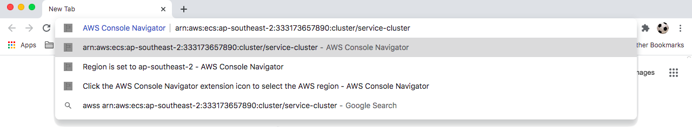
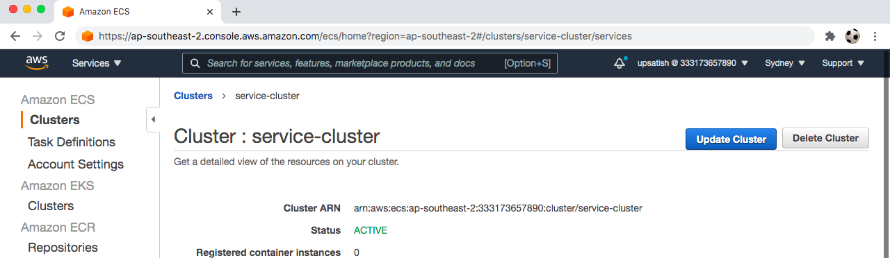
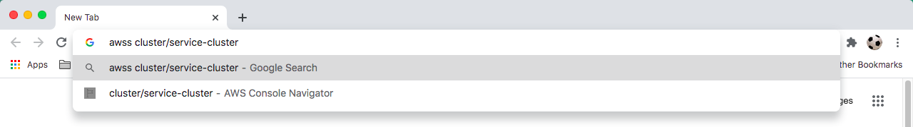
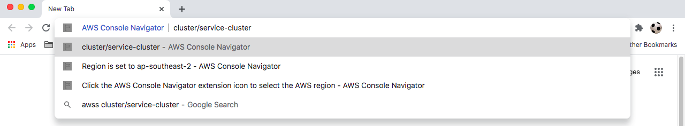
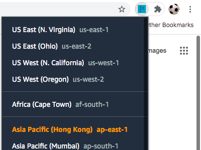

# AWS Console Navigator

AWS Console Navigator [browser extension](#add-to-browser). Go to AWS console resources from your browser's search box.
To use, type keyword 'awss' space one of the following terms into the Omnibox:

- ARN (Amazon Resource Name)
- AWS resource ID
- resourceType:resourceID (short ARN / ARN substring / URL substring)
- resourceType/resourceID (short ARN / ARN substring / URL substring)

**Example using ARN**

**Example using keyword**

## Add to browser

### Add to Chrome

Add the [AWS Console Navigator Chrome extension](https://chrome.google.com/webstore/detail/enlgbafmiepkajfipklgilnljlfbdkbo) from the [Chrome Web Store](https://chrome.google.com/webstore).

### Add to Firefox

Add the [AWS Console Navigator Firefox add-on](https://addons.mozilla.org/en-US/firefox/addon/aws-console-navigator/) from [Firefox Add-Ons](https://addons.mozilla.org/en-US/firefox/).

## Navigation examples

Sign in to an AWS account is required to access the AWS management console. AWS Console Navigator cannot switch accounts. Some example keywords of AWS console navigation:

- awss vpc-5a03f891 (navigate by keyword)
- awss i-478eb362bbbcfc439f (navigate by keyword)
- awss arn:aws:ecs:ap-southeast-2:333173657890:cluster/service-cluster (navigate by ARN)
- awss cluster/service-cluster (navigate by short ARN / ARN substring)
- awss stack/service-cluster-stack (navigate by short ARN / ARN substring)
- awss arn:aws:dynamodb:us-east-1:206936434116:table/transaction (navigate by ARN)
- awss table/transaction (navigate by short ARN / ARN substring)

## Region selection

Click the AWS Console Navigator extension icon to select the AWS region for navigation by resource ID and resourceType:resourceID or resourceType/resourceID (short ARN / ARN substring). The selected region is highlighted in the popup and displayed as an Omnibox suggestion. Region selection is not required for navigation by ARN.

## Supported resources

### Navigate by resource ID or ARN or resourceType:resourceID or resourceType/resourceID (short ARN / ARN substring)

Resources that can be navigated by resource ID or ARN or resourceType:resourceID or resourceType:resourceID(short ARN / ARN substring):

- VPC
- EC2 instance
- Security group
- Transit gateway
- DHCP options sets
- Internet gateway
- Network ACL
- Subnet
- Route table
- Network interface
- Volume
- Key pair
- AMI
- Virtual private gateway
- Transit gateway attachment
- Transit gateway route table
- VPC peering connection

### Navigate by ARN or resourceType:resourceID or resourceType/resourceID (short ARN / ARN substring) only

Resources that can be navigated by ARN or service:resourceID or resourceType:resourceID (short ARN / ARN substring) only:

- S3 bucket
- Codebuild project
- Lambda function
- Cloudwatch events rule
- Cloudwatch log group
- Cloudformation stack
- Secretsmanager secret
- DynamoDB table
- ECS cluster
- ECS task definition
- ECS tasks
- RDS DB
- State machine state
- IAM user
- IAM group
- IAM role
- IAM policy

### Navigate by ARN only

- SQS queue
- SNS topic
- RDS cluster
- AWS service role IAM policy
- AWS service role IAM role
- CodeCommit repository

#### resourceType:resourceID or resourceType/resourceID (short ARN / ARN substring) format examples

Examples of the service:resourceID (short ARN / ARN substring) format:

| ARN                                                             | resourceType:resourceID or resourceType/resourceID (short ARN / ARN substring / URL substring) |
| --------------------------------------------------------------- | ---------------------------------------------------------------------------------------------- |
| arn:aws:ecs:ap-southeast-2:333173657890:cluster/service-cluster | cluster/service-cluster                                                                        |
| arn:aws:dynamodb:us-east-1:206936434116:table/transaction       | table/transaction                                                                              |

## Unsupported resources

These resources could not be supported:

- DB security group
- KMS key
- Config rule
- Glacier

## Contributing

See [CONTRIBUTING.md](CONTRIBUTING.md).

## License

GNU GPLv3 License, see [LICENSE](LICENSE).
